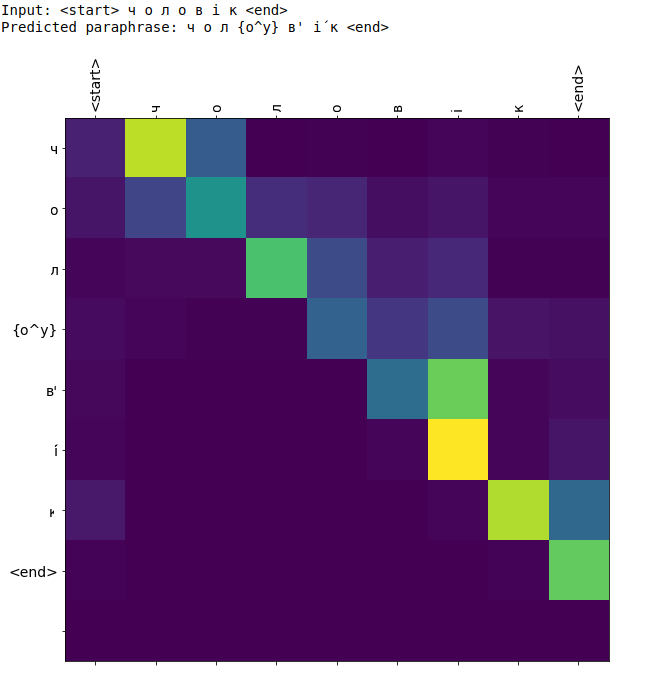
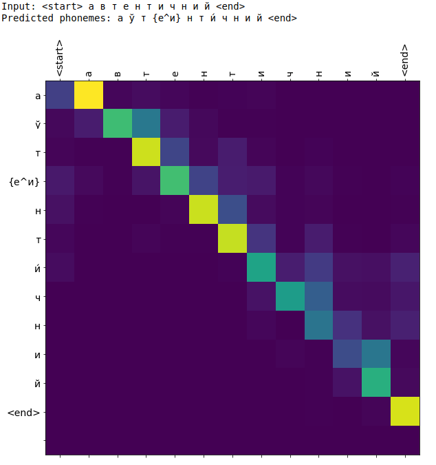

# g2p_uk

This repository contains grapheme2phoneme Ukrainian model.

### Model
This is sequence-to-sequence model with 1024 GRU and 10 Attention units

### Training data

Model was trained on 160k of normalized ukrainian words with their phone transcription.  
Train set -- 152k, val set -- 8k

### Evaluation results
For model evaluation was used Word Accuracy metric (WAcc). 
For training we used different scenarios:
1. Removing stress from the training and val data. 
It means that we are trying to predict phonemes w/o effect of stressed letters.
2. Keeping stressed letters in the training and val data. 
In this case we are trying to predict not only the phoneme of the word, 
but also the position of stress in the sequence.
3. Keeping stressed letters only in the training data.
Here we train model on the phonemes that contains stressed letters, 
but for validation we ignoring the position on the stress. 
It allows us to include stress as a feature, but ignore it's impact on the final result.
4. Removing stress and simplifying phonemes **ay** -> **a** in all data.

| scenario | train WAcc, % | val WAcc, % |
|----------|---------------|-------------|
| 1        | -             | 86.15       |
| 2        | -             | 80.73       |
| 3        | -             | 88.42       |
| 4        | -             | 98          |

### Attention weights examples

Example 1:

Example 2:
